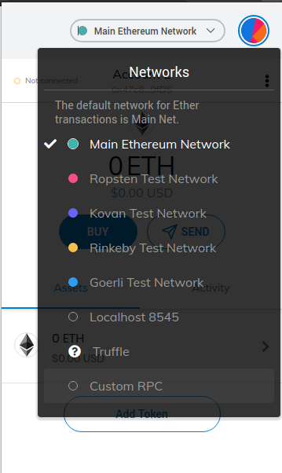
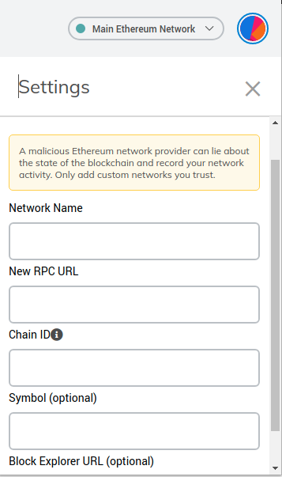

# Klip

Proyecto para participar en la hackaton identihack organizada por DIDI, un proyecto de identidad digital auto-soberana a través de blockchain.

## Pre-requisitos

Este proyecto emplea [Truffle](https://www.trufflesuite.com/docs/truffle/getting-started/installation) para su ejecución, el cual está basado en Node.

## Instalación y ejecución

Para ejecutar este proyecto se debe abrir una consola de comandos y moverse a la carpeta source en la raíz del proyecto, allí se debe ejecutar los siguientes comandos:

```bash
npm install
truffle develop
migrate --reset
```
Luego abrir una nueva consola de comandos y moverse a la carpeta source/klip-app en la raíz del proyecto, allí se debe ejecutar:

```bash
npm install
npm run start
```

Conectar con metamask:

- Abrir metamask en el navegador

  

- Clic en el dropdown para elegir la red

- Clic en Custom RPC

  

- Ingresar los siguientes datos:

  - Network Name: Truffle
  - New RPC URL: http://127.0.0.1:8545/
  - Chain ID: 5777

- Elegir la cuenta y presionar Connect

  
